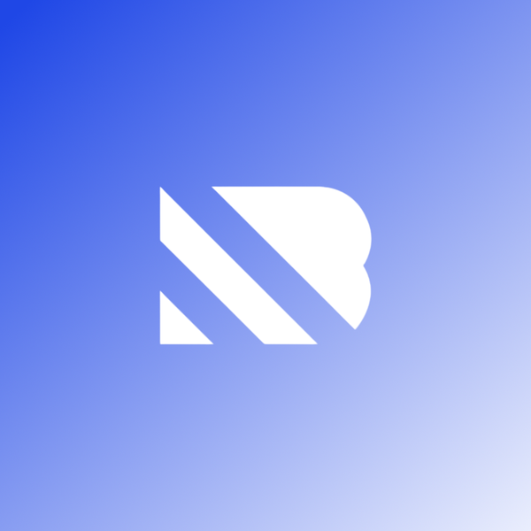

  

<h3 align="center">An applied research lab teaching AI to understand, remember, and act inside real operations.</h3>

  <a href="https://www.nodeblue.ai">Website</a> &nbsp;·&nbsp; <a href="https://www.nodeblue.ai/research">Research</a> &nbsp;·&nbsp; <a href="https://www.nodeblue.ai/systems">Systems</a> &nbsp;·&nbsp; <a href="https://www.nodeblue.ai/nexus">Nexus</a> &nbsp;·&nbsp; <a href="https://www.nodeblue.ai/contact">Contact</a>

---

### About

Nodeblue is an independent applied research lab in St. Petersburg, Florida. We study how software can read, reason over, and act inside the real operations the physical world runs on.

Our research produces working systems. The first, **Nexus**, already runs on live plant floors.

### What we are exploring

- **Operational Intelligence** &nbsp;·&nbsp; reading a live operation the way an experienced engineer does, then reasoning over it. *Running today in Nexus.*
- **Knowledge & Memory** &nbsp;·&nbsp; how an organization keeps what it learns long after the people who learned it move on. *Prototyping as Atlas.*
- **Human & AI Collaboration** &nbsp;·&nbsp; the division of labor between human judgment and machine reasoning. *Built into Nexus today.*
- **Autonomy & Execution** &nbsp;·&nbsp; crossing from understanding a situation to safely acting inside it. *The furthest edge, becoming Forge.*

### Systems we are building

| System | What it is | Status |
|---|---|---|
| [**Nexus**](https://www.nodeblue.ai/nexus) | Operational intelligence for industrial environments. Reads control logic, supervisory systems, and documentation together to diagnose faults and answer questions in plain language, cited to the exact source. | 🟢 In use |
| [**Atlas**](https://www.nodeblue.ai/systems) | A living model of how an operation works, so its knowledge stays current instead of decaying in documents. | 🟡 In development |
| [**Forge**](https://www.nodeblue.ai/systems) | What lets a system cross from analysis to safe action, with the verification real consequences demand. | 🟡 In development |

### Open source

Early community tooling from our work on Nexus — MCP connectors that give any AI agent structured access to industrial platforms:

| Connector | What it does |
|---|---|
| [**studio5000-mcp-server**](https://github.com/Nodeblue-AI/studio5000-mcp-server) | Rockwell/Allen-Bradley Studio 5000 — parse L5X exports: tags, UDTs, routines, AOIs, cross-references |
| [**ignition-mcp-server**](https://github.com/Nodeblue-AI/ignition-mcp-server) | Ignition SCADA — views, scripts, tags, UDTs, alarms, live gateway read/write |
| [**bridge-mcp-server**](https://github.com/Nodeblue-AI/bridge-mcp-server) | Correlates Ignition SCADA tags with Studio 5000 PLC logic end-to-end |

These connectors are the file-parsing layers. [**Nexus**](https://www.nodeblue.ai/nexus) is the complete system — reading and reasoning over the whole operation, from PLC logic, SCADA, and live controller data to documentation, fault history, and MES/ERP records — cross-vendor, with live fault diagnosis, a persistent memory of the operation, and every answer cited to the source.

### Get in touch

We are a small team with backgrounds at Tesla, Amazon, Applied Materials, and beyond. If the work resonates, we would love to hear from you.

  <a href="https://www.nodeblue.ai/careers">Careers</a> &nbsp;·&nbsp; <a href="https://www.nodeblue.ai/partners">Partners</a> &nbsp;·&nbsp; <a href="https://www.nodeblue.ai/blog">Writing</a> &nbsp;·&nbsp; <a href="https://www.linkedin.com/company/91704671/">LinkedIn</a> &nbsp;·&nbsp; <a href="https://www.youtube.com/@NodeblueAI">YouTube</a> &nbsp;·&nbsp; <a href="https://x.com/NodeblueAI">X</a>

